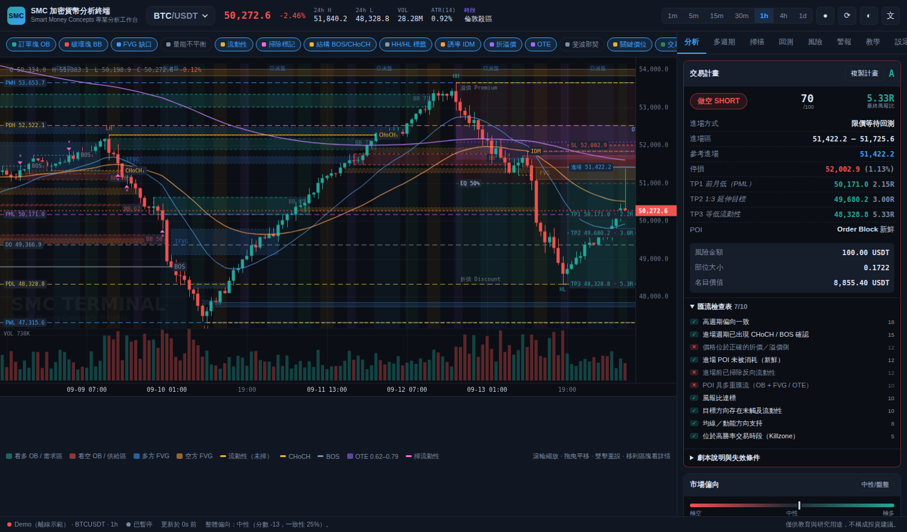

# SMC 加密貨幣分析終端 · SMC Crypto Terminal

以 **Smart Money Concepts（SMC / ICT）** 方法論分析加密貨幣市場的專業級網頁終端機。
零依賴、零建置、純前端 —— 打開 `index.html` 就能用，所有運算都在你的瀏覽器裡完成，不上傳任何資料。

> ⚠️ 本工具僅供教育與研究用途，**不構成投資建議**。加密貨幣槓桿交易風險極高，請自行承擔結果。



*（畫面為離線示範資料，實際使用時會連接交易所即時行情）*

---

## 部位管理：勝率從 33% 拉到 75% 的那一段

訊號本身沒有變，變的是「進場之後怎麼管」。三條規則：

| 規則 | 做什麼 | 為什麼 |
|---|---|---|
| **保本鏢** | 到 +0.5R 先出掉 1/3 | 停損單裡有一半以上曾經跑到 +0.5R 才反轉，等於白白放掉 |
| **移到成本價** | 同時把停損拉到進場價 +0.05R | 0.05R 是用來蓋手續費的，不然「保本」實際上還是小虧 |
| **追蹤停損** | 獲利超過 1R 後，停損跟著最高點走，距離 0.5R | 讓剩下 2/3 的部位有機會跑遠，同時鎖住已有的利潤 |

這些數字是實測出來的，不是拍腦袋決定的。`scripts/research/ab-test.mjs`
會先產生一份訊號清單，再讓每一組規則去跑**同一份訊號**，所以唯一的變數
就是規則本身。在三組互不重疊的幣種上（合計 4,592 個訊號）跑出來：

| 幣種組 | 目前線上 | 新規則 |
|---|---|---|
| BTC/ETH/SOL… 10 檔 | 35.1% · +23.9R · 回撤 39.5R | **74.6% · +76.4R · 回撤 9.3R** |
| DOT/NEAR/APT… 12 檔 | 33.4% · +89.9R · 回撤 65.9R | **73.7% · +133.9R · 回撤 9.2R** |
| TON/ICP/PEPE… 12 檔 | 36.2% · +111.2R · 回撤 47.7R | **75.7% · +157.9R · 回撤 10.0R** |

筆數完全沒有減少（1208 → 1236 之類的差異是因為保本出場讓交易更早結束，
反而多結算了幾筆）。

要自己重跑：Actions → 策略研究（A/B 實測）→ Run workflow。

### 順帶一提，有個想法被實測否決了

「逆行超過 0.75R 就認賠」在交易日誌那 59 筆樣本裡看起來很合理
（9 筆獲利單的最大逆行只有 0.68R）。但放到 4,592 筆之後，它是所有變體裡
最差的之一 —— 最大回撤反而從 47.7R 惡化到 59.3R。所以預設是關閉的
（`scratchR: 0`），程式碼留著讓你想試的時候可以打開。

同樣被否決的還有兩種「進場後發現不對就先走」（2026-09，兩組各 15 幣 × 30m/1h/4h，
前後半段分開看，扣手續費後）：

- **時間停損**（`stallBars`）：成交後 6／12／24 根都沒到 +0.3R 就收盤出場
- **進場區失守**（`zoneCloseExit`）：收盤跌破進場區就出場，不等停損

它們在行情差的那段確實少虧一點，進場區失守還讓其中一組的最大回撤從 8.3R 降到 3.9R；
但在行情好的那段，會把「先往下洗一下再大漲」的單提早砍掉，期望值明顯變差
（例如 +0.17R → +0.09R）。四格（兩組幣 × 前後半段）沒有一個變體全部贏過現行規則，
所以預設關閉。用 Actions 的研究工作流程、`variants` 填 `FINAL,FINAL_stall12,FINAL_zone` 就能重跑。

## 用 Bybit 下單（模擬盤與實盤）

「下單」分頁可以直接把目前的交易計畫送到 Bybit。

- **金鑰只存在你自己的瀏覽器**（localStorage），不會上傳、不會進倉庫、
  不會出現在推播裡。換手機就要重新填一次。
- 模擬盤與實盤**各存一組金鑰**，切換時不會沿用另一邊的。
- 實盤要多打一次 `REAL` 才解鎖，按鈕是紅色的。
- **每一張進場單都一定同時帶停損**；沒有停損就拒絕送出。
- 數量用固定風險法算：停損越寬數量越小，每筆的最大虧損固定在你設定的 %。

申請金鑰時：**只勾 Unified Trading — Trade**，
**絕對不要勾提領（Withdraw）**。模擬盤金鑰在 testnet.bybit.com 申請，
跟實盤是兩套完全獨立的帳號。

## 為什麼做這個

市面上多數「SMC 分析網站」只做到三件事：畫幾個訂單塊、標個 BOS、給一個沒有理由的多空結論。
這個專案想做得更完整、更專業、也更看得懂：

| | 一般 SMC 網頁工具 | 本專案 |
|---|---|---|
| 結構判定 | 只有單一級別 | **雙尺度**（內部 Internal + 擺動 Swing），BOS 與 CHoCH 嚴格區分 |
| 訂單塊 | 找一根反向 K 棒就畫 | 需通過**位移強度（ATR 倍數）**驗證，並追蹤 fresh → tapped → mitigated → **Breaker** 的完整生命週期，附品質評分 |
| FVG | 只畫框 | 追蹤**填補百分比**、CE 中線、失效後轉為 **IFVG（反轉缺口）**，並過濾雜訊缺口 |
| 流動性 | 畫前高前低 | **流動性池群聚**（EQH/EQL）、掃除偵測（含深度 ATR）、**誘導 IDM**、上下方吸引力量化 |
| 多空結論 | 一句「看多」 | **可解釋的偏向評分**（每個因子的貢獻分數都列出）＋多週期加權矩陣與一致性 |
| 交易計畫 | 沒有，或只有進場價 | 進場區／停損／**三段目標（都對應真實流動性）**／風報比／**10 項匯流檢查表**／失效條件／部位大小 |
| 驗證 | 無 | 內建**訊號回測**（逐步重算、無未來函數）與 **K 棒回放**模式 |
| 學習 | 無 | 內建**教學辭典**：每個術語都說明「是什麼 / 本程式怎麼算 / 實戰怎麼用」 |
| 可靠度 | 單一資料源，被擋就掛 | **四層資料源自動備援**（Binance → Bybit → OKX → 離線示範） |
| 品質保證 | 無 | 30 項單元測試涵蓋結構、缺口、流動性、區間、計畫與引擎純度 |

---

## 📱 在 iPhone / iPad 上使用

這個 App 本來就是為手機設計的（響應式版面、觸控縮放平移、可加到主畫面全螢幕執行）。
三種方式，依「最推薦」排序：

### 方式 1：GitHub Pages（推薦，有網址、可加到主畫面、自動更新）

1. 到 GitHub repo → **Settings → General** → 最下方 **Danger Zone** →
   **Change repository visibility** → 改為 **Public**
   （GitHub 免費帳號的 Pages 不支援私有倉庫；這個 App 沒有任何密鑰，公開沒有風險）
2. 到 **Actions → Deploy to GitHub Pages → Run workflow** 執行一次
   （workflow 會自動幫你開啟 Pages，不必手動設定）
3. 完成後網址是：`https://<你的帳號>.github.io/<倉庫名>/`
4. iPhone 用 **Safari** 打開該網址 → 點下方 **分享** → **加入主畫面**

加到主畫面後會以全螢幕啟動（沒有網址列）、有自己的圖示，且因為內建 Service Worker，
**沒有網路時也能打開**（此時會自動使用離線示範資料）。

### 方式 2：保持倉庫私有 → 用 Cloudflare Pages / Netlify（免費且支援私有倉庫）

1. 註冊 Cloudflare Pages（或 Netlify），選 **Connect to Git** 授權這個倉庫
2. Build command 留空、Output directory 填 `/`（本專案不需要建置）
3. 部署後會得到 `xxx.pages.dev` 網址，一樣可以加到主畫面

### 方式 3：單檔離線版（完全不需要伺服器或帳號）

`standalone/smc-terminal.html` 是把所有程式、樣式、圖示打包成的**單一檔案**。

1. 在電腦上下載這個檔案（或用 `npm run build:single` 重新產生）
2. 透過 AirDrop／iCloud 雲碟／LINE／Email 傳到 iPhone
3. 在「檔案」App 中點開 → 會用 Safari 顯示，功能與完整版相同

限制：本機檔案無法「加入主畫面」，且部分瀏覽器對 `file://` 的網路請求較嚴格，
若抓不到交易所行情會自動切換為離線示範資料。

> 附帶一提，方式 1 與 2 都只是「把靜態檔案放上網」，沒有後端、沒有資料庫、
> 不會收集任何資料；你的設定與自選清單只存在你自己手機的瀏覽器裡。

### 手機版操作

| 操作 | 方式 |
|---|---|
| 換幣種／週期 | 圖表上方的**快速切換列**（可左右滑） |
| 調整圖表與面板比例 | 拖曳中間的**分隔條**，或點一下循環三種比例 |
| 圖表太擠 | 點工具列的 **標準** 按鈕循環「精簡／標準／完整」圖層 |
| 縮放圖表 | 兩指捏合 |
| 平移圖表 | 單指拖曳 |
| 看區塊詳情 | 點一下該區塊（OB / FVG / 流動性線） |
| 圖表全螢幕 | 工具列最右邊的 ⛶ |
| 分析面板全螢幕 | 右上角 ☰ |
| 切換圖層 | 工具列的彩色標籤（可左右滑動） |

橫向持握時，版面會自動變成「左圖表 + 右面板」，跟桌機一樣。

---

## 🔔 訊號推播到 Discord

每 15 分鐘自動掃描，有符合條件的訊號就推到你的 Discord 頻道。
**跑在 GitHub 的伺服器上，所以手機關著、網頁沒開也會通知。**

### 設定（只要做一次）

1. **在 Discord 建立 webhook**
   你的伺服器 → 選一個頻道 → 齒輪「編輯頻道」→ **整合** → **Webhook** → **新增 Webhook**
   → **複製 Webhook 網址**
2. **把網址存進 GitHub**
   Repo → **Settings** → **Secrets and variables** → **Actions** → **New repository secret**
   - Name：`DISCORD_WEBHOOK_URL`（也接受 `SMC` 這個名稱）
   - Secret：剛剛複製的網址
3. **測試**
   Repo → **Actions** → **SMC 訊號推播** → **Run workflow** → 模式選 **test** → 執行
   Discord 收到「連線測試」訊息就代表成功。

> ⚠️ Webhook 網址等同於「可以在你頻道發言的鑰匙」，只放在 GitHub Secrets，**絕對不要寫進程式碼**（這個倉庫是公開的）。

### 會推播什麼

| 類型 | 觸發條件 | 預設 |
|---|---|---|
| **交易計畫** | 出現有效計畫且評分 ≥ 68、風報比 ≥ 2 | ✅ 開 |
| **進入 POI** | 價格進入品質 ≥ 68、且**與當前偏向同向**的訂單塊／FVG | ✅ 開 |
| **模擬單成效** | 追蹤中的計畫進場／達標／停損／作廢 | ✅ 開 |
| **每日晨報** | 每天台灣時間 08:00 | ✅ 開 |
| **CHoCH** | 剛出現性質轉變（趨勢可能反轉） | ❌ 關 |
| **流動性掃除** | 剛掃過前高／前低 | ❌ 關 |

訊息內含方向、進場區、停損、三段目標與各自 R 值、匯流檢查通過項目、高週期偏向、失效條件。

### 交易日誌在哪裡看

完整紀錄就是 [**`data/journal.md`**](data/journal.md) —— 由機器人每次執行自動更新，
直接在 GitHub 上打開就能看，不需要額外的介面：

- **總覽**：已結束交易筆數、勝率、期望值、總報酬、獲利因子、最大回撤、最長連敗
- **分級表現／各幣種表現**：依 A/B/C 評級與幣種分組統計
- **進行中**：目前追蹤中的模擬單，含已達成的目標
- **最近結束的交易**：最新 60 筆的完整明細

原始資料在 [`data/signals.json`](data/signals.json)，程式或試算表都能直接讀。

### 模擬盤：自動驗證訊號到底準不準

每一則推播出去的**交易計畫**都會變成一筆模擬單，之後每 15 分鐘用新的 K 棒推進它：

```
⏳ 已進場        價格回到進場區，模擬單成交
✅ TP1 達成      +1.0R，停損自動移到成本價（之後最差是平手）
🎉 全部達成      以最後一個目標結算
❌ 停損          -1.0R，並附上「最大有利幅度曾到過幾 R」
⌛ 未進場作廢    等超過 24 根 K 棒沒回到進場區（不計入勝率）
```

每則結果都會附上累計戰績：`12 筆 · 勝率 58% · 期望值 +0.74R`。

完整紀錄存在 **[`data/journal.md`](data/journal.md)**（可直接在 GitHub 上閱讀），
含總覽、分級表現、各幣種表現、進行中部位與最近交易明細。原始資料在 `data/signals.json`。

**規則說明**（力求誠實，不美化數字）：
- 同一根 K 棒同時觸及停損與目標 → 算停損
- 打到第一個目標後，停損移到成本價
- 已達標後回落到成本價出場 → 保守只認一半的 R，因為實際上會分批出場
- 未進場的作廢單**不計入**勝率，另外單獨統計
- 不含手續費、滑價與資金費率

> ⚠️ 這是**模擬**，不是真實下單。它的用途是讓你在投入真錢之前，先用兩三週的實際數據
> 判斷這套訊號值不值得跟。

### 全市場掃描

每次掃描會把**成交量前 120 名的 USDT 交易對**跑過一遍（排除穩定幣對與槓桿代幣），
分成兩份清單：

| | 意思 | 怎麼用 |
|---|---|---|
| 🟢 **現在可進場** | 價格已經在 POI 區間內 | 可以直接執行 |
| ⏳ **等待回測** | 計畫成立但價格還沒回到進場區 | 掛限價單或設價格提醒 |

- 網站的**掃描分頁**切到「全市場」即可看到完整清單，點任一列直接跳到該幣種的圖表
- 結果同時存成 [`data/market.md`](data/market.md)，可直接在 GitHub 上瀏覽
- 其中評分 ≥ 72 且「現在可進場」的標的會自動推到 Discord（每次最多 3 則，
  並自動納入模擬盤追蹤）

掃描採兩階段：先用 1h 粗篩全部交易對，再對前 30 名補抓日線偏向精算，
這樣 API 用量與執行時間都能壓在合理範圍。

### ⚡ 即時進場提醒（Cloudflare Worker）

「等待回測」的標的可能在任何時候碰到進場區，但 GitHub 的排程不保證準時
（實測每 15 分鐘的設定可能變成 2–3 小時一次）。因此把工作拆成兩半：

| 工作 | 在哪跑 | 頻率 | 為什麼 |
|---|---|---|---|
| 全市場 SMC 分析（重運算） | GitHub Actions | 每小時 | 結構不會 5 分鐘就變，算得慢沒關係 |
| **價格到了沒（輕運算）** | **Cloudflare Worker** | **每 2 分鐘** | 只比對現價與已算好的進場區，CPU 幾乎不用 |

Worker 只做一件事：讀最新的 `market.json`，比對現價，
**價格一回到進場區就立刻推 Discord**，並記住已通知過的標的避免洗頻。
如果價格已經穿過停損，或掃描結果太舊（> 4 小時），它會安靜不叫。

#### 設定（一次就好）

1. 註冊 [Cloudflare](https://dash.cloudflare.com)（免費方案就夠）
2. 右上角 **My Profile → API Tokens → Create Token → Create Custom Token**
   - 權限加兩條：**Account · Workers Scripts · Edit**、**Account · Workers KV Storage · Edit**
   - 建立後複製 Token
3. 回主控台首頁，右側複製 **Account ID**
4. 到 GitHub Repo → **Settings → Secrets and variables → Actions**，
   在 **Secrets** 分頁（不是隔壁的 Variables 分頁）按 **New repository secret**，新增兩個：
   （Token 用 `CF_API_TOKEN` 或 `CLOUDFLARE_API_TOKEN` 都可以，兩個名稱都接受。
   如果舊的那個填錯了，直接新增 `CF_API_TOKEN` 就會蓋過去，不必去更新舊的。）
   - `CLOUDFLARE_API_TOKEN`
   - `CLOUDFLARE_ACCOUNT_ID`

   > 左側選單裡 Actions／Codespaces／Dependabot 各有一組 secret，
   > 一定要選 **Actions** 那一組，其他兩組工作流程讀不到。
   > 名稱必須一字不差（全大寫、底線）。
5. 到 **Actions → 部署 Cloudflare Worker → Run workflow** 執行一次

#### 如果部署一直卡在「No access to the specified resource」

某些帳戶的 Scoped Token 沒辦法寫入 Workers 指令碼，即使權限勾得完全正確
（Cloudflare 那邊沒給出明確原因）。這時改用 **Global API Key**：

1. https://dash.cloudflare.com/profile/api-tokens 頁面最下方「API 金鑰」
   區塊，Global API Key 旁邊按 **檢視**，輸入密碼後複製
2. 到 GitHub 加兩個 secret：
   - `CF_EMAIL`：你登入 Cloudflare 的 email
   - `CF_GLOBAL_API_KEY`：剛複製的那串
3. 重新執行部署，這一步會自動改用這組驗證

Global API Key 等同帳號本人登入、沒有範圍限制，安全性比 Scoped Token
低，建議部署成功後就把它從 GitHub Secrets 刪掉（不影響已部署的 Worker）。

部署流程會自動建立 KV 命名空間、部署 Worker，並把既有的 Discord webhook
同步過去 —— 不需要在 Cloudflare 那邊再貼一次。

#### 確認有在運作

Worker 部署後會有一個網址（在 Cloudflare 主控台 Workers 頁面可以看到）：

```
https://smc-signals.<你的子網域>.workers.dev/status   檢查設定與資料新鮮度
https://smc-signals.<你的子網域>.workers.dev/run?dry=1 立刻試跑一次（不推播）
```

#### 調整

`worker/wrangler.toml` 的 `[vars]`：

| 變數 | 預設 | 意思 |
|---|---|---|
| `MIN_SCORE` | 65 | 只盯幾分以上的計畫 |
| `NEAR_PCT` | 0.08 | 距離進場區多近算「到了」（%） |
| `ALERT_TTL_SEC` | 21600 | 同一個進場區多久內不重複通知（秒） |
| `MAX_MARKET_AGE_MIN` | 240 | 掃描結果超過多久就不再據以提醒（分） |

改完推到 `main` 會自動重新部署。

#### ⚡⚡ 讓 Worker 自己即時掃描（選用，需要 Workers Paid）

預設情況下，「新機會多久出現一次」取決於 GitHub Actions 的排程——設定
是 15 分鐘一次，但 GitHub 免費版對排程會嚴重節流，**實際上常常是 2～4
小時一次**（GitHub 的已知限制，不是這個專案設定錯）。這支 Worker 每 2
分鐘的執行預設只做「比對現價」這種輕量工作，不夠格自己重新分析。

升級到 **Workers Paid**（$5/月，CPU 時間上限從 10ms 拉到 30 秒）之後，
可以讓 Worker 自己做即時分析。CPU 其實綽綽有餘（實測 120 檔全掃不到 1
秒），真正的限制是**對外請求**：Cloudflare 邊緣節點打外部 API 是從共用
IP 出去，跟其他 Cloudflare 客戶共用，一次塞太多請求容易被交易所的 IP
限流擋掉（實測一次掃 20 檔就有 3 成起跳的失敗率）。所以採**分批**架構：
候選池（依成交量排序取前 `WORKER_SCAN_TOP` 檔）不是一次掃完，而是每隔
`WORKER_SCAN_BATCH_INTERVAL_MIN` 分鐘只真的重新掃描其中
`WORKER_SCAN_BATCH_SIZE` 檔（同一批內再用 `WORKER_SCAN_CONCURRENCY` 限
制同時發出的請求數），結果累積進 KV，繞完一輪候選池就等於整個候選池都
更新過一次：

```toml
# worker/wrangler.toml 的 [vars]
WORKER_SCAN_ENABLED = "true"
WORKER_SCAN_TOP = "120"                 # 候選池總大小，依成交量排序取前 N 檔
WORKER_SCAN_BATCH_SIZE = "20"           # 每批真的重新掃描幾檔
WORKER_SCAN_BATCH_INTERVAL_MIN = "10"   # 幾分鐘算下一批
WORKER_SCAN_INTERVAL = "4h,1h,30m"      # 逗號分隔可以同時開多個進場週期
WORKER_SCAN_MIN_SCORE = "0"             # 掃描累積門檻，故意很低（幾乎不濾）
WORKER_SCAN_CONCURRENCY = "3"           # 單批內同時發出的請求數，共用 IP 別調太大
WORKER_SCAN_PROVIDERS = "bybit,binance,okx"  # 資料源順序，預設優先用 Bybit
```

`WORKER_SCAN_INTERVAL` 可以同時開多個週期：每個週期各自輪流掃描候選池，
同一個 tick 只真的重新掃描「一個」最久沒更新的週期，其他到期的留給下一
個 tick——所以同一個 tick 的請求量（固定是一批 `WORKER_SCAN_BATCH_SIZE`
檔）不會因為多開週期而變大，只是把原本大部分 tick 都空著沒用的時間拿來
輪流服務其他週期；每個週期各自涵蓋一輪候選池的時間跟只開一個週期時一樣
（見下面的算法），不會因為週期變多就變慢，等於是用同樣的請求預算換到
更多組獨立的訊號來源（同一檔幣種在不同週期會有不同的計畫，彼此不衝突）。

`WORKER_SCAN_MIN_SCORE` 跟 `MIN_SCORE`（要不要因此推播／下單的門檻）是
**兩件事**，刻意分開：掃描累積這一步只要「是個有效計畫」就先存起來（跟
GitHub Actions 那份 `data/market.json` 的做法一致），`MIN_SCORE` 只在
比對現價那一步決定要不要因此推播／下單。如果掃描這一步直接套用
`MIN_SCORE` 當篩選門檻，累積結果會被鎖死在「這一批剛好有幾檔當下超過
門檻」，候選池繞完一輪也留不下多少標的——這是實測踩過的坑，`WORKER_SCAN_MIN_SCORE`
就是修這個問題加的，不要把它跟 `MIN_SCORE` 設成同一個值。

上面這組預設值：120 檔 ÷ 20 檔一批 = 6 批，6 批 × 10 分鐘 ≈ **1 小時**
把整個候選池都掃過一次；同一檔幣種平均要等將近 1 小時才會被重新分析一次，
但因為是分批輪流掃，實際上**每 10 分鐘就有一批新資料進來**，不是整批
一次到齊、一次過期。想要更即時可以縮小 `WORKER_SCAN_TOP`（候選池變小，
繞一輪更快）或拉大 `WORKER_SCAN_BATCH_SIZE`（單批算更多檔，但單批請求
更密集、更容易被限流，請斟酌；同時也可以調低 `WORKER_SCAN_CONCURRENCY`
換取更穩定的成功率）。

Worker 每 2 分鐘還是會照排程執行一次，但那是「比對現價、判斷有沒有進場」
的輕量工作；還沒輪到下一批時直接沿用 KV 累積的結果，完全不會打外部 API，
只有真的輪到那一批才會重新分析——兩個頻率（2 分鐘反應價格、批次輪替掃描
全池）分開設定、互不影響。

改完推到 `main`，GitHub Actions 會用 esbuild 把 Worker 跟它需要的 SMC
引擎打包成一個檔案再部署（部署流程已經處理好，不用自己動手）。

**這份即時掃描只給這支 Worker 自己用**（即時比對進場區、自動下單），
**預設不會**寫回 `data/market.json`，App 網站「全市場掃描」頁面看到的還是
GitHub Actions 算的那份（120 檔、含資金費率），兩邊互不取代、各自獨立
——除非另外設定下面「把結果寫回 data/market.json」那節，才會讓 App 頁面
也跟著即時更新。

⚠️ **開啟前要知道的取捨**：
- 分批架構下，同一檔幣種平均要等接近一輪的時間才會重新分析一次
  （預設約 1 小時），不是每一檔都即時更新——真正即時的只有「現價有沒有
  碰到已經算好的進場區」這一步
- 對外部交易所 API 的請求量會增加（每 `WORKER_SCAN_BATCH_INTERVAL_MIN`
  分鐘一批），請留意交易所本身的速率限制
- 沒有資金費率／未平倉量資料（GitHub 那份才有，除非另外開了下面那節，
  開了的話會自動保留舊檔裡的資金費率，不會消失）

`/status` 的 `workerScanEnabled`、`workerScanCache`（`coveredSymbols` /
`poolTotal` / `lastBatchAgeMinutes`）可以確認目前是不是真的在用這個模式、
分批進度到哪、涵蓋了候選池裡幾檔。

#### 把結果寫回 data/market.json，讓 App 頁面也跟著即時更新（選用）

上面這節預設只給 Worker 自己用，App 網站「全市場掃描」頁面還是得等
GitHub Actions 的排程（常常被節流成 2～4 小時一次）。設定這個之後，
Worker 每算完一批（約每 `WORKER_SCAN_BATCH_INTERVAL_MIN` 分鐘一次）就會
順便把累積的結果寫回 `data/market.json`，App 頁面不用再等 GitHub 排程。

1. 到 [GitHub → 右上角頭像 → Settings → Developer settings →
   Personal access tokens → Fine-grained tokens](https://github.com/settings/tokens?type=beta)
   → **Generate new token**
2. **Repository access** 選 **Only select repositories**，只勾這個倉庫
   （絕對不要選「All repositories」）
3. **Permissions → Repository permissions → Contents** 選 **Read and write**，
   其他權限都不用給
4. 建立後複製 Token，到 GitHub Repo → **Settings → Secrets and variables →
   Actions → Secrets** 分頁新增一個名為 `GITHUB_API_TOKEN` 的 secret
5. 改完推到 `main`，下次部署 Worker 時會自動同步這把 Token

```toml
# worker/wrangler.toml 的 [vars]，通常不用改，倉庫名對不上才需要設
GITHUB_REPO = "你的帳號/倉庫名"
GITHUB_MARKET_PATH = "data/market.json"
```

資金費率／未平倉量（GitHub Actions 那份才會另外去抓）不會因此消失：
寫入前會先讀舊檔，把舊資料裡每個標的的資金費率原封不動接到新資料同一個
標的上，Worker 這批新掃到、舊檔沒有的標的才會沒有這欄（顯示「—」）。
寫入失敗（Token 過期、網路問題）不影響 Worker 其他功能，安靜略過、
下次執行再試。

### 🤖 自動下單（Demo 模擬交易，選用，預設關閉）

Worker 偵測到「價格回到進場區」的那一刻，除了推 Discord，也可以順手在
Bybit **模擬交易（Demo）** 帳戶自動送出一張市價單。刻意只接 Demo（假錢）：
這是先驗證整條自動下單管線本身可不可靠，不是要你直接拿真錢自動交易。

> 目前實測（45 筆已結算模擬單）勝率 37.8%、期望值 +0.12R，其中 A+ 級跟
> 做空方向實際上是負的（見 App 掃描頁的 ⚠️ 標記）。這個策略還沒有強到
> 適合真錢自動化，接 Demo 只是為了讓你在不動用真錢的情況下，看到
> 「自動下單這件事本身」運作起來會是什麼樣子。

#### 為什麼需要 Executor

Bybit 對美國地區的 IP 有整體封鎖（CloudFront 直接回「configured to block
access from your country」），Cloudflare Worker 對外用的是共用、會變動的
出口 IP，偶爾會被分配到判定成美國的節點，一旦分配到，查餘額、下單這些
Bybit 私有 API 呼叫就會全部失敗。所以 Worker 本身**不直接呼叫 Bybit**，
改成把已經算好的交易指令（數量、槓桿、停損、分批出場階梯）送給一個獨立
部署的服務——**Bybit Executor**（`executor/` 資料夾），由它跑在固定 IP、
非美國地區的 VPS 上，直接跟 Bybit 對話。Worker 那邊的策略邏輯完全沒變。

詳細架構、API 規格、安全機制、部署步驟見 [`executor/README.md`](executor/README.md)。

#### 設定

1. **部署 Executor**：照 [`executor/README.md`](executor/README.md) 的步驟，
   在一台非美國地區的 VPS 上把它架起來（`deploy/setup-vps.sh` 一鍵完成大部分
   設定），並在前面加一層 HTTPS（例如 [Caddy](https://caddyserver.com/)）
2. 到 [bybit.com](https://www.bybit.com) 主站（不是 testnet.bybit.com）→
   右上角帳號選單切換到 **模擬交易 / Demo Trading** → API 管理 → 建立 API Key
   - **只勾 Trade，絕對不要勾 Withdraw**
   - 這組金鑰填進 Executor 的 `.env`（`BYBIT_API_KEY` / `BYBIT_API_SECRET`），
     **不會**出現在 Cloudflare Worker 這邊
3. 到 GitHub Repo → Settings → Secrets and variables → Actions → Secrets 分頁，新增：
   - `EXECUTOR_URL`：Executor 的 HTTPS 網址（例如 `https://executor.你的網域.com`）
   - `EXECUTOR_HMAC_SECRET`：跟 Executor `.env` 裡的 `EXECUTOR_HMAC_SECRET`
     完全一樣的隨機字串（`openssl rand -hex 32` 產生）
   - `AUTO_TRADE_TOKEN`：自己隨便取一長串亂碼，用來保護下面的開關網址，
     不要用容易猜到的字
4. 到 **Actions → 部署 Cloudflare Worker → Run workflow** 重新部署一次，
   讓這幾個 secret 同步到 Worker

#### 開關 —— 這是預設關閉的，設定完金鑰也不會自動開始下單

```
https://smc-signals.<你的子網域>.workers.dev/auto-trade/status         查看目前開/關（唯讀，不用 token）
https://smc-signals.<你的子網域>.workers.dev/auto-trade/status?detail=1 同上，再列出每筆追蹤中部位的完整內容（含分批出場階梯每一段有沒有掛失敗）
https://smc-signals.<你的子網域>.workers.dev/auto-trade/on?token=xxx   開啟
https://smc-signals.<你的子網域>.workers.dev/auto-trade/off?token=xxx  關閉
```

`token` 就是上面設定的 `AUTO_TRADE_TOKEN`。建議把 **off** 那個網址加到手機
主畫面，當作隨時可以按的緊急煞車——不用改任何程式碼或金鑰，開一個網頁
就能整個關掉。

**定期自我檢查**：`.github/workflows/health-check.yml` 每 2 小時會自動打一次
`/status` 跟 `/auto-trade/status`，檢查有沒有 Cloudflare 例外、市場資料太舊、
Bybit 呼叫持續失敗等異常，有問題會直接推播到 Discord（沿用同一個
webhook），不用等到自己發現「怎麼好像沒在跳通知」才想到要來查。這支
工作流程只讀不寫，不會動到任何設定，也可以在 Actions 分頁手動執行一次。

**或者直接在 App 裡開關**：「下單」分頁最下面有一張「自動下單（Cloudflare
Worker）」卡片，填一次 Worker 網址跟 token（只存這台裝置，不會上傳），
之後就能直接在 App 裡看狀態、按按鈕開關，不用記網址。

#### 下單邏輯

- 只在 Worker 判定「等待回測的計畫，價格剛回到進場區」那一刻觸發，
  跟 Discord 通知共用同一個去重機制：同一個進場區只會下單一次
- 判斷「價格回到進場區了沒」用的現價，優先抓 **Bybit** 的報價（跟實際下單
  的合約類別一致），打不到才退到 Binance，兩者都失敗最後退到 OKX
- 數量 = Demo 帳戶目前可用餘額 × `AUTO_TRADE_RISK_PCT`（**固定值，
  不分評分高低**）÷ 停損距離，市價進場單一律帶停損
- **單筆保證金上限**：停損距離很近時，光靠上面那個公式算出來的數量可能
  需要用掉幾乎全部的可用保證金，變成一張單就把其他訊號的下單空間吃光。
  `AUTO_TRADE_MAX_MARGIN_PCT` 限制單筆最多佔用可用餘額的這個 %——超過會
  先試著拉高槓桿（不超過合約上限）省保證金，還是不夠才縮小數量；縮小
  數量代表這筆萬一真的停損出場，實際虧損會比 `AUTO_TRADE_RISK_PCT` 設定
  的更小，方向保守，不會讓風險變大
- **出場套用本文開頭「部位管理」那段 A/B 實測驗證過的同一組規則**
  （`src/smc/manage.js`，跟回測、模擬盤追蹤共用同一份常數，不是另外憑感覺
  調的）：開倉當下就把「保本鏢（+0.5R 出場 34%）＋ 原本的目標價」一次掛成
  真的 Bybit reduce-only 限價單，價格到了交易所自己成交；停損則由 Worker
  每次執行時檢查獲利有沒有過門檻——到 +0.5R 搬到成本價 +0.05R，超過 +1R
  之後改成追蹤停損、距離最高獲利 0.5R，只會愈移愈緊，不會反向鬆開
- **槓桿照評分線性插值**：評分等於 `MIN_SCORE` 給 `AUTO_TRADE_LEVERAGE_MIN`
  倍、100 分給 `AUTO_TRADE_LEVERAGE_MAX` 倍，中間內插，並自動不超過該合約
  本身的槓桿上限。之所以只有槓桿照評分調、倉位大小不照評分調：槓桿只影響
  「用多少保證金」，不影響「這筆最多虧多少錢」（風險金額永遠由停損距離
  決定），所以不會有「分數愈高賭愈大」的問題；倉位大小如果也照分數放大，
  等於在目前實測表現最弱的那一級（見下方掃描頁的 ⚠️ 標記）押更多錢，
  暫時刻意不做
- 目前**不過濾**任何等級或方向，全部訊號都會嘗試下單
- 下單成功或失敗都會寫進對應的 Discord 訊息，不會有「下單失敗但你不知道」的情況
- **部位平倉也會通知**：下單成功後會記住這筆部位，之後每次執行都會比對
  Bybit 現在實際的持倉——追蹤中的部位不見了就代表平倉了，推一則結算通知
  （✅/❌ 加上估算的 R）。這裡刻意不用 Bybit 的「已平倉損益」查詢端點：
  官方文件跟社群都有回報這個端點對 Demo 帳戶不穩定，改用「原本追蹤的部位
  是不是還在」這個角度換算，代價是平倉價是**用偵測到當下的市價估算，
  不是交易所回報的精確成交價**，會有幾分鐘內的些微誤差，推播裡會註明。
  保本鏢／目標價分批出場**不會**另外推播——部位還在（只是變小了）就不算
  平倉，通知只在整筆部位真的結清時才發一次

`worker/wrangler.toml` 的 `[vars]` 可調整：

| 變數 | 預設 | 意思 |
|---|---|---|
| `AUTO_TRADE_RISK_PCT` | 5 | 每筆風險占 Demo 帳戶可用餘額的 %（調高會讓單筆賺賠都放大，同時能同時撐住的倉位數會變少）。模擬盤紀錄出現過連 19 敗：5% 會虧掉約 62%，2% 約 32% |
| `AUTO_TRADE_LEVERAGE_MIN` | 3 | 評分等於 `MIN_SCORE` 時用的槓桿倍數 |
| `AUTO_TRADE_LEVERAGE_MAX` | 10 | 評分 100 分時用的槓桿倍數 |
| `AUTO_TRADE_MAX_MARGIN_PCT` | 25 | 單筆最多佔用可用餘額的 %，避免停損很近時一張單吃光整個帳戶的保證金 |
| `AUTO_TRADE_DIRECTIONS` | long,short | 允許自動下單的方向，逗號分隔（只填 `long` 就只做多）。不在清單裡的方向照樣推播、照樣進模擬盤紀錄，只是不下單 |
| `AUTO_TRADE_EXCLUDE_POI` | （空＝不排除） | 不自動下單的進場區類型，逗號分隔（空字串＝全部都下）。行為同上：照樣推播、只是不下單。模擬盤 73 筆裡 Order Block 24 筆平均 -0.19R，想排除就填 `Order Block` |
| `AUTO_TRADE_MAX_OPEN_RISK_PCT` | 0（不限制） | 所有追蹤中部位「停損打到還會虧多少」加總的上限（占帳戶 %，0＝不限制）。幣圈同漲同跌，同時開一堆同方向的單等於同一個賭注。搬到成本價以上的部位剩餘風險是 0、不佔額度。超過上限的新訊號只通知不下單 |
| `AUTO_TRADE_MIN_STOP_PCT` | 0（不限制） | 停損距離（占進場價 %）低於這個值就只通知不下單（0＝不限制）。手續費按倉位價值收，停損 0.5% 時一進一出的吃單費約吃掉 0.22R；回測裡停損 <1% 的單扣完手續費是負的 |

### 每日晨報

每天台灣時間 08:00 推一份總結：各幣種現價與偏向、關鍵時間價位（PDH/PDL/PWH/PWL）、
最近的未觸及流動性、進行中的模擬單、累計戰績，以及當天三個交易時段的台灣時間。

### 📒 每 3 天一次交易回顧

台灣時間每 3 天早上 09:00，把最近 3 天結算的模擬單拆成「賺錢的」跟「賠錢的」
兩組，各自列出等級／方向／週期／型態／來源的分布，讓人一眼看出這幾天賺錢的
單子大多長什麼樣子、賠錢的大多長什麼樣子。

刻意**不會自動調整任何規則或評分邏輯**——3 天通常只有個位數到十幾筆交易，
單一次看到的「共同點」很可能只是雜訊。要同一個型態在好幾次回顧裡重複出現，
才值得認真考慮要不要調整。想手動看一次，用 Actions 手動執行 `signals.yml`、
模式選 `review`（會直接推播）；想在本機先看結果、不推播，直接跑
`node scripts/discord-notify.mjs --review --dry-run`。

### 📊 每週績效報告

每週一台灣 09:00（`.github/workflows/weekly-report.yml`，排程只在 main 上生效）推一份：

- Demo 帳戶實際淨值，跟上週、跟第一次報告比
- 目前持倉數與風險佔用（對照 `AUTO_TRADE_MAX_OPEN_RISK_PCT`）
- 模擬盤紀錄裡**符合目前自動下單規則**（≥ 65 分，多空都算）
  的訊號，本週與新規則上線以來的績效，**已扣手續費**
- 下面「什麼時候可以放真錢」四個門檻的達成進度

淨值每週記一筆在 `data/account-history.json`。想先看內容不推播：Actions 手動執行、勾 `dry_run`。

### 💰 什麼時候可以放真錢（以 300U 小資金為例）

**四個門檻全部達到才上真錢**（每週報告會自動檢查）：

1. 新規則上線後，符合下單規則的交易累積 **200 筆**以上
2. 扣手續費後每筆期望值 **≥ +0.05R**
3. 這段期間最大回撤 **≤ 15R**
4. Demo 帳戶淨值連續 **4 週**以上、沒有跌破起始金額

門檻是事先訂好的，目的是不要因為連贏幾天就衝動上真錢，也不要因為連輸幾天就亂改規則。

**上真錢之後：**

- 前一個月 `AUTO_TRADE_RISK_PCT` 用 **1**（300U 每單最多虧 3U），確認實盤跟 Demo 表現一致再慢慢調回來
- 小資金會有部分幣種下不了單：Bybit 每個合約有最小下單量，分批出場的每一段都要大於它，
  像 BTC 這種單價高的，300U 的倉位切成三段常常不夠，程式會直接跳過（Discord 會寫原因）
- 停損很近的單手續費會吃掉大半獲利，想擋掉可以把 `AUTO_TRADE_MIN_STOP_PCT` 設成 1

**複利的現實（回測數字，實盤通常會打折）：**

下表的 +0.10R 是「只做多、排除 Order Block、停損 ≥ 1%、新評分權重」那組規則的回測值
（2026-09-24 試過、隔天改回）。**目前的設定（多空都做、不過濾、舊權重）回測扣手續費後大約打平**，
這種情況下複利不會成長；要重新套用那組規則，把上面設定表的值改回去即可。每單風險 2% 時：

| 每筆期望值 | 本金翻倍大約要 | 翻 10 倍大約要 |
|---|---|---|
| +0.10R（回測值） | 約 390 筆 | 約 1300 筆 |
| +0.05R（保守） | 約 890 筆 | 約 2950 筆 |

實際要幾個月，取決於每週真的下了幾筆，每週報告會顯示。另外，同一段期間
**定期補一點本金**對小資金的成長速度影響，通常比調高風險大得多，而且不會增加爆倉的機率。

### 調整設定

編輯根目錄的 `signals.config.json`，推到 `main` 就生效：

```jsonc
{
  "symbols": ["BTCUSDT", "ETHUSDT", "SOLUSDT", "BNBUSDT", "XRPUSDT", "DOGEUSDT"],
  "intervals": ["15m", "1h"],   // 多週期掃描，高週期偏向會自動對應（15m→4h、1h→1d）
  "minScore": 68,               // 評分門檻（越高訊號越少、品質越嚴）
  "minRR": 2,                   // 最低風報比
  "notify": { "plan": true, "poiTouch": true, "choch": false, "sweep": false }
}
```

「進入 POI」只在**第一個週期**通知，避免多週期洗頻；交易計畫則每個週期都會掃。

覺得太吵就把 `minScore` 調到 75、或把 `poiTouch` 關掉；覺得太安靜就調到 60。

### 本機測試

```bash
node scripts/discord-notify.mjs --probe                        # 測試交易所連線
node scripts/discord-notify.mjs --dry-run --providers=demo     # 用離線資料看會推什麼
node scripts/discord-notify.mjs --brief --dry-run              # 預覽晨報內容
DISCORD_WEBHOOK_URL=... node scripts/discord-notify.mjs --test # 送測試訊息

# 端到端測試（不動到正式帳本、不送到真的 Discord）
SMC_DATA_DIR=/tmp/smc SMC_ALLOW_ANY_WEBHOOK=1 \
  DISCORD_WEBHOOK_URL=http://localhost:8899/hook node scripts/discord-notify.mjs
```

### 注意事項

- 只分析**已收盤**的 K 棒，同一個訊號不會重複通知（狀態存在 Actions 快取）
- **GitHub 的排程不保證準時**：設定每 15 分鐘，實測可能變成 2–3 小時一次（免費方案的已知行為）。
  因此掃描範圍刻意做寬（多幣種 × 多週期），讓每次掃描都能覆蓋更多機會；
  若要穩定的高頻掃描，需要改用 Cloudflare Workers 之類的專用排程服務
- **倉庫連續 60 天沒有任何活動，GitHub 會自動停用排程**；到時候進 Actions 頁面按一下重新啟用即可
- 這是**研究與提醒工具，不是自動交易機器人**，不會也不能幫你下單
- 實測（GitHub 美國機房）：Binance ✓、OKX ✓、Bybit ✗ 403 —— 已設定為自動備援，不影響運作

---

## 快速開始（電腦）

```bash
# 需要 Node.js 18+（只用來開靜態伺服器，程式本身無任何依賴）
npm start            # → http://localhost:8080
# 或指定埠號
node scripts/serve.mjs 3000
```

也可以直接把整個資料夾丟到任何靜態空間（GitHub Pages / Netlify / Cloudflare Pages）。
因為使用原生 ES Modules，**不能**用 `file://` 直接開啟，必須透過 HTTP 伺服器。

```bash
npm test             # 執行 30 項單元測試
npm run build:single # 重新產生單檔離線版 standalone/smc-terminal.html
```

---

## 功能導覽

### 圖表（自製 Canvas 引擎，無第三方圖表庫）
- K 棒／空心／線圖／面積圖、成交量副圖、滾輪縮放、拖曳平移、雙擊重設、觸控雙指縮放
- 疊圖層可個別開關：訂單塊、破壞塊、FVG、量能不平衡、流動性、掃除標記、結構線、HH/HL 標籤、
  誘導 IDM、折溢價、OTE、斐波那契、關鍵價位（PDH/PDL/PWH/PWL/PMH/PML）、交易時段、EMA、VWAP、成交量分佈
- 滑鼠移到任一區塊即顯示詳情（成因、位移倍數、相對量能、消耗百分比、品質分數）
- 一鍵匯出 PNG

### 分析面板
- **交易計畫**：方向、進場區、參考進場、停損、TP1–TP3（含各自 R 值與對應的流動性目標）、
  10 項匯流檢查表（逐項顯示通過與權重）、劇本說明、失效條件、部位大小；未達標準的計畫會明確標示警告
- **市場偏向**：-100 ~ +100 的分數，並列出每個因子的貢獻（擺動結構、內部結構、折溢價、流動性吸引、EMA、RSI）
- **市場結構**：雙尺度結構、受保護高低點（強／弱）、區間位置條、IDM 狀態
- **POI 清單**：依「品質 × 方向一致性 × 距離現價」排序
- **流動性地圖**：上下方未觸及流動性、強度條、最近三次掃除
- **關鍵時間價位**：與現價的距離百分比

### 其他分頁
- **多週期**：4 個週期的偏向 / 結構 / 區間 / 計畫矩陣，加權總分與一致性，並產生「由上而下」的文字敘事
- **掃描**：一次分析自選清單或成交量前 20／50 名，依計畫評分排序，點一下直接跳轉
- **回測**：逐步重算驗證訊號品質，輸出勝率、期望值、獲利因子、最大回撤、分級表現與權益曲線
- **風險**：固定風險％的部位大小計算（含保證金與實際槓桿），可一鍵帶入目前計畫
- **警報**：價格穿越／進入 POI／結構事件／流動性掃除，支援瀏覽器通知
- **教學**：16 個核心術語 + 六步驟實戰流程
- **設定**：資料源、K 棒數量、時區、全部 SMC 參數（靈敏度、突破判定、OB 區間定義、位移門檻、
  FVG 最小值、流動性容差、最低風報比、停損緩衝）、多週期組合、匯出設定

### 快捷鍵
`←` `→` 回放上下根 · `+` `-` 縮放 · `R` 重新整理 · `T` 切換主題 · 雙擊圖表重設視圖

---

## SMC 引擎的判定規則（摘要）

完整規格見 [`docs/METHODOLOGY.md`](docs/METHODOLOGY.md)。

| 概念 | 判定方式 |
|---|---|
| 擺動點 | n 根對稱分形（左側嚴格、右側容許等值），再強制高低交替保留極值 |
| BOS / CHoCH | 以收盤價（可改影線）突破最近一個已確認且未被突破的擺動點；順勢為 BOS、逆勢為 CHoCH |
| 強／弱高低點 | 造成 BOS 的擺動點為「強」，被推開而未取得流動性者為「弱」 |
| Order Block | 結構突破前的最後一根反向 K 棒，且推動腿位移 ≥ 1 ATR（可調）；追蹤回測、消耗與失效 |
| Breaker | OB 被收盤穿越後角色反轉 |
| FVG | `low[i] > high[i-2]`（多）或 `high[i] < low[i-2]`（空），並以 ATR 過濾；追蹤填補率與反轉 |
| 流動性池 | 容差（ATR × 係數）內的擺動點群聚，記錄觸及次數、是否等高等低、是否已掃除 |
| 掃除 Sweep | 影線穿越擺動點但收盤收回，記錄穿越深度（ATR 倍數） |
| 誘導 IDM | 最近一次結構事件推動腿中的最後一個次級反向擺動點，並追蹤是否已被取走 |
| 折溢價 | 以最近一組確認擺動高低構成交易區間（價格突破時自動延伸），50% 為均衡 |
| OTE | 區間回撤 0.618–0.79，0.705 為甜蜜點 |
| 偏向分數 | 擺動結構 ±34、內部結構 ±16、折溢價 ±12、流動性吸引 ±12、EMA50 ±8、EMA200 ±10、RSI ±8 |
| 計畫方向 | 高週期偏向 60% + 進場週期偏向 40%；兩者強烈分歧時會標註警告 |
| 停損 | POI 另一側與受保護高低點取較外者，再加 0.35 ATR 緩衝，且不得小於 0.3 ATR |
| 目標 | 依序取最近的未觸及流動性 → 關鍵時間價位 → 區間極值 → 1:3 延伸（過濾 <0.8R 與 >12R） |

---

## 資料來源

| 順序 | 來源 | 說明 |
|---|---|---|
| 1 | Binance Spot | REST + WebSocket 即時 K 棒（自動嘗試三個網域） |
| 2 | Bybit v5 Spot | REST + WebSocket |
| 3 | OKX v5 Spot | REST（自動分頁）+ WebSocket |
| 4 | Demo | 離線合成資料：具趨勢腿、回調、掃流動性與位移缺口，固定亂數種子可重現 |

任一來源失敗（地區封鎖、CORS、暫時故障）會**自動切換到下一個**並在畫面提示。
全部失敗時退回 Demo，介面永遠可用。所有請求都是公開端點，**不需要 API Key，也不會碰你的帳號**。

---

## 專案結構

```
index.html                  單一頁面
manifest.webmanifest        PWA 設定（加到主畫面、全螢幕、圖示）
sw.js                       Service Worker（離線啟動）
standalone/                 單檔離線版（由 scripts/build-single.mjs 產生）
assets/styles/main.css      設計系統（深／淺色主題、響應式、iOS 安全區域）
assets/icons/               App 圖示（含 apple-touch-icon）
src/
  core/      utils / indicators（EMA, ATR, RSI, VWAP, Volume Profile）/ store / bus
  data/      providers（Binance, Bybit, OKX, Demo）/ feed（備援、快取、串流）
  smc/       swings → structure → liquidity → fvg → orderblocks → zones → sessions
             → engine（統合）→ setups（交易計畫）→ mtf（多週期）→ backtest
  chart/     chart（Canvas 引擎）/ layers（SMC 疊圖）/ scales / theme
  ui/        panels / scanner / alerts / glossary / dom
  i18n/      繁體中文 / English
tests/       30 項單元測試（node --test）
scripts/     零依賴靜態伺服器、單檔打包器、Discord 訊號推播、全市場掃描
worker/      Cloudflare Worker（每 2 分鐘的即時進場提醒）
signals.config.json  訊號推播設定（監控幣種、門檻、通知類型、追蹤參數）
data/                模擬盤帳本（由 Actions 自動維護）
docs/        方法論與架構文件
```

`src/smc/*` 全部是**純函式**，不依賴瀏覽器，因此可以直接在 Node 中測試，
也讓回放模式能用「只看得見當下資料」的方式重算，避免未來函數。

---

## 設計原則

1. **可解釋 > 神秘**：每個分數都列出組成因子，每個計畫都列出通過與未通過的條件。
2. **誠實 > 好看**：回測用保守假設（同根 K 棒同時觸及時算停損），並明確標示未達標準的計畫。
3. **零依賴**：沒有 npm 套件、沒有打包器、沒有追蹤碼，程式碼看得懂也改得動。
4. **離線可用**：資料源全掛也能用 Demo 模式學習與展示；加到主畫面後沒網路也能開啟。
5. **手機優先**：不是把桌面版縮小，而是針對窄螢幕重新調整圖表密度、刻度與版面。

---

## 授權與免責

MIT License。本專案為教育與研究工具，作者不對任何交易損益負責。
資料由第三方交易所公開 API 提供，可能延遲或中斷；SMC 是一套主觀的價格行為框架，
本程式的量化實作只是其中一種詮釋，**請務必自行驗證後再使用**。
